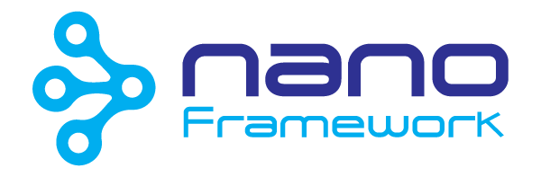

-----

# **nanoFramework** Home

This _Home_ repository is the starting point for developers that want to learn about **nanoFramework**, contribute to it or opening issues.
It contains links to the various GitHub repositories used by **nanoFramework**.

**nanoFramework** goal is to be a platform that enables the writing of managed code applications for constrained embedded devices. 
Developers can harness the familiar IDE Visual Studio and their .NET (C#) knowledge to quickly write applications without having to worry about the low level hardware intricacies of a micro-controller.

Being a developer you'll probably will fit in one (or maybe both :wink:) of the following _profiles_:
- Developer: if your goal is to develop C# applications for micro-controllers.
- Contributor: if you are interested in actively contributing by coding (native, managed, C, C++, CMake), writing documentation or participating in the overall project organization.

# Repositories

- [nf-interpreter](https://github.com/nanoframework/nf-interpreter) - this repo contains the **nanoFramework** CLR, interpreter, target boards configuration and the build system. This is where everything required to build an image to be flashed into a device lives.

- [nf-class-libraries](https://github.com/nanoframework/nf-class-libraries) - this repo contains the various Class Libraries (Core library - mscorlib, Windows.Devices.Gpio, Windows.Devices.Spi, etc.) that are used in developing C# applications. Each of those Solutions include the Nuget package configuration that is used in building each of those packages for distribution.

- [nf-Visual-Studio-extension](https://github.com/nanoframework/nf-Visual-Studio-extension) - this repo contains the Visual Studio extension and all the associated tools required to compile and build a **nanoFramework** managed application ready to deploy to a target device.

- [nf-Community-Targets](https://github.com/nanoframework/nf-Community-Targets) - this repo contains target boards that are contributed by community members. You might find here _inspiration_ for your next board.

- [nf-debugger](https://github.com/nanoframework/nf-debugger) - this repo contains the debugger library (in several technologies) allowing reuse of the low lower library by third party applications.

- [nf-ANT](https://github.com/nanoframework/nf-ANT) - this repo contains an UWP application that connects to a **nanoFramework** target and can provide basic information about it along with some basic management operations. The development of this tool has been put on a halt because its features and capabilities are now available in Visual Studio through the Device Manager window.

- [ChibiOS](https://github.com/nanoframework/ChibiOS) - this repo contains a mirror of the official ChibiOS SVN repository. It's used as the default source for building **nanoFramework** images.

- [nf-github-bot](https://github.com/nanoframework/nf-github-bot) - this repo contains the code for the **nanoFramework** bots.

## How to Engage, Contribute and Provide Feedback

Some of the best ways to contribute are to try things out, file bugs, and join in design conversations. 
If you are having issues or need a clarification about something, instead of opening an issue the best way is to start a conversation in one of our Slack channels.
Please select the one that's most appropriate to the matter you are facing.

If you've find a bug or can't use Slack, please open an issue at [Issues](https://github.com/nanoframework/Home/issues).
We ask you to open an issue only when you have a real and confirmed one. Don't open an issue for support requests or to start a discussion. For that you'll get a better (and quicker!) support/feedback in one of the Slack channels.

Looking for something to work on? Check the list of up-for-grabs issues on any of the repositories, that's a great place to start..

See some of our guides for more details:

* [Contributing Guide](CONTRIBUTING.md)
* [Developer Guide](docs/contributing/developer-guide.md)

## Documentation

### [Docs](docs/)

The project documentation is a great place to find information about **nanoFramework**, no matter if you are newcomer or a veteran. It's organized in the following categories:
- [Developing C# applications](docs/developing-apps) using **nanoFramework**.
- [Building an image](docs/building) to load on a target board.
- [**nanoFramework** architecture](docs/architecture/) and how the different pieces fit together.
- [Contributing to **nanoFramework**](docs/contributing/) includes an overview on how you can contribute to the project. 

### [Blog](https://nanoframework.wordpress.com)

There is a blog where we try to post detailed updates about the development status, technical posts about a particular feature ou a design option.

## Who is behind this project?

There are a number of people behind this project. We are mostly embedded systems enthusiasts, passionate about coding and people that like challenges. 
All of us have our daily jobs and we work on this project in our free time.
That is to say that you can always expect an answer from us. Maybe not instantly but in a - hopefully - timely fashion :wink: !

## Code of Conduct
This project has adopted the code of conduct defined by the [Contributor Covenant](http://contributor-covenant.org/)
to clarify expected behavior in our community.
