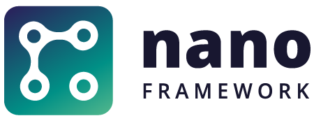

   

-----
Document Language: [English](README.md) | [简体中文](README.zh-cn.md)

# .NET **nanoFramework** Home

This _Home_ repository is the starting point for developers that want to learn about .NET **nanoFramework**, contribute to it or opening issues.
It contains links to the various GitHub repositories used by .NET **nanoFramework**.

.NET **nanoFramework** goal is to be a platform that enables the writing of managed code applications for constrained embedded devices.
Developers can harness the familiar IDE Visual Studio and their .NET (C#) knowledge to quickly write applications without having to worry about the low level hardware intricacies of a micro-controller.

It is part of the [.NET Foundation](https://www.dotnetfoundation.org/).

Being a _developer_ you'll probably will fit in one (or more than one😉) of the following _profiles_:

- You can enjoy to develop C# applications for micro-controllers.
- You can become a contributor as there are lots of areas to express yourself:
  - C/C++ native drivers working low level directly on the MCU with our Platform Abstraction Layer and Hardware Abstraction Layer, RTOS, developing .NET CLR for nanoFramework.
  - Managed C#  to write new classes and drivers to add more bindings, libraries to .NET nanoFramework.
  - Managed C# to write tools like the Visual Studio Extensibility, debugger and others mostly .NET Core/.NET 5 CLI applications.
  - Help in setting up Azure DevOps pipelines to automate as much as possible.
  - Writing and improving our Unit Tests.
  - Helping others by answering their questions.
  - Writing and improving documentation, doing PR reviews or participating in the overall project organization.

.NET nanoFramework is a fun and interesting way to learn. It’s a complete project with a lot of deep engineering. You’ll find a vibrant [community](https://github.com/nanoframework/Home#how-to-engage-contribute-and-provide-feedback) to help you and you’ll be able to help as well. We do welcome all kind of contributions and we aim to give visibility to our contributors.

# Sponsoring .NET **nanoFramework**

Most of the core team members and contributors are embedded systems enthusiasts, passionate about coding and people that like challenges. The work on .NET **nanoFramework** is done mostly on their free time. Some of the core members happen to work on companies that sponsor heavily **nanoFramework** and offer their work hours to the project. If you use .NET **nanoFramework** for serious work or want to support it, please donate. This allow for paying the infrastructure cost and more time to be invested on the project. Besides monetary contributions, there are several other ways to contribute. Please read the documentation about this [here](http://docs.nanoframework.net/content/contributing/index.html).

This is how we use the donations:

- Pay for infrastructure costs.
- Develop public relation actions to get the project known.
- Support maintainers and contributors that invest a large amount of time in the project.
- Support projects that .NET **nanoFramework** depends on.
- Produce documentation, tutorials and other content to support developers using .NET **nanoFramework**.
- Organize events to demo .NET **nanoFramework**.

## Sponsors

Sponsors will get their logo and link to a website on our GitHub readme and also on our home page.

### Bronze Sponsors

 

## Backers

Backers are individuals who contribute with money to help support nanoFramework. Every little bit helps and we appreciate all contributions, even the smallest ones.

## Other backers and sponsors

There are other people and organizations that have contributed to .NET **nanoFramework** along the time in several ways: sponsoring the coding of a feature that was missing or needed improvement, paying for an expense, coding a feature or... We would like to acknowledge these sponsors.

<table>
 <tr>
  <td></td>
  <td></td>
 </tr>
</table>

## Firmware for reference boards

Each of the following ZIP files contains the image files for nanoBooter and nanoCLR in various formats (HEX, BIN and DFU). They should be flashed in the target boards using an appropriate software utility.

The **stable** versions are continuous builds of the reference targets. They include the latest version of all features and bug corrections. They also have **managed** debugging features enabled along with detailed error messages, but exclude **native** debugging features and only minimal (or no) error messages.

For native debugging, please download the [nf-interpreter](https://github.com/nanoframework/nf-interpreter) repository and build locally.

Besides the firmware images below, you can find several others for community provided target boards. Check the available ones and download links on the [Community Targets repo](https://github.com/nanoframework/nf-Community-Targets).

### ESP32 modules and boards

| Target | Stable |
|:-|---|
| ESP32_PSRAM_REV0 |  |
| ESP32_REV0 |  |
| ESP32_PSRAM_XTAL26_REV0 |  |
| ESP32_PSRAM_REV3 |  |
| ESP32_REV3 |  |
| ESP32_BLE_REV0 |  |
| ESP32_BLE_REV3 |  |
| ESP_WROVER_KIT |  |
| ESP32_PICO |  |
| ESP32_LILYGO |  |
| FEATHER_S2 |  |
| KALUGA_1 |  |
| ESP32_C3 |  |
| ESP32_C3_REV3 |  |
| ESP32_OLIMEX |  |
| XIAO_ESP32C3 |  |
| ESP32_S3 |  |
| ESP32_S3_BLE |  |

### M5Stack

| Target | Stable |
|:-|---|
| [M5Core](https://docs.m5stack.com/en/core/gray) |  |
| [M5StickC](https://docs.m5stack.com/en/core/m5stickc) |  |
| [M5StickCPlus](https://docs.m5stack.com/en/core/m5stickc_plus) |  |
| [M5Core2](https://docs.m5stack.com/en/core/core2) |  |
| [AtomS3](https://docs.m5stack.com/en/core/AtomS3) |  |

### STM32 boards and chip based

| Target | Stable |
|:-|---|
| ST_STM32F429I_DISCOVERY (B01) |  |
| ST_NUCLEO64_F091RC |  |
| ST_STM32F769I_DISCOVERY |  |
| ORGPAL_PALTHREE |  |

### Silicon Labs Giant Gecko boards

| Target | Version |
|:-|---|
| SL_STK3701A |  |
| SL_STK3701A_REVB |  |

### NXP boards

| Target | Stable |
|:-|---|
| NXP_MIMXRT1060_EVK |  |

### TI boards

| Target | Stable |
|:-|---|
| TI_CC1352R1_LAUNCHXL_868 |  |
| TI_CC1352R1_LAUNCHXL_915 |  |
| TI_CC3220SF_LAUNCHXL |  |

The above firmware builds include support for the class libraries and features marked below.

  
Click to expand!

   | Target                  | Gpio               | Spi                | I2c                | Pwm                | Adc                | Dac                | Serial             | OneWire            | Events             | SWO                | Networking         | Bluetooth BLE    | Large Heap         | UI         |
  |:-:                      |:-:                 |:-:                 |:-:                 |:-:                 |:-:                 |:-:                 |:-:                 |:-:                 |:-:                 |:-:                 |:-:                 |:-:                 |:-:                 |:-:                 |
  | ESP32_PSRAM_REV0          | :heavy_check_mark: | :heavy_check_mark: | :heavy_check_mark: | :heavy_check_mark: | :heavy_check_mark: | :heavy_check_mark: | :heavy_check_mark: | :heavy_check_mark: | :heavy_check_mark: |                    | :heavy_check_mark: |                    | :heavy_check_mark: |                    |
  | ESP32_REV0          | :heavy_check_mark: | :heavy_check_mark: | :heavy_check_mark: | :heavy_check_mark: | :heavy_check_mark: | :heavy_check_mark: | :heavy_check_mark: | :heavy_check_mark: | :heavy_check_mark: |                    | :heavy_check_mark: |                    | :heavy_check_mark: |                    |
  | ESP32_PSRAM_XTAL26_REV0          | :heavy_check_mark: | :heavy_check_mark: | :heavy_check_mark: | :heavy_check_mark: | :heavy_check_mark: | :heavy_check_mark: | :heavy_check_mark: | :heavy_check_mark: | :heavy_check_mark: |                    | :heavy_check_mark: |                    | :heavy_check_mark: |                    |
  | ESP32_PSRAM_REV3          | :heavy_check_mark: | :heavy_check_mark: | :heavy_check_mark: | :heavy_check_mark: | :heavy_check_mark: | :heavy_check_mark: | :heavy_check_mark: | :heavy_check_mark: | :heavy_check_mark: |                    | :heavy_check_mark: |                    | :heavy_check_mark: |                    |
  | ESP32_REV3          | :heavy_check_mark: | :heavy_check_mark: | :heavy_check_mark: | :heavy_check_mark: | :heavy_check_mark: | :heavy_check_mark: | :heavy_check_mark: | :heavy_check_mark: | :heavy_check_mark: |                    | :heavy_check_mark: |                    | :heavy_check_mark: |                    |
  | ESP32_BLE_REV0      | :heavy_check_mark: | :heavy_check_mark: | :heavy_check_mark: | :heavy_check_mark: | :heavy_check_mark: | :heavy_check_mark: | :heavy_check_mark: | :heavy_check_mark: | :heavy_check_mark: |                    | :heavy_check_mark: | :heavy_check_mark: |                    |                    |
  | ESP32_BLE_REV3      | :heavy_check_mark: | :heavy_check_mark: | :heavy_check_mark: | :heavy_check_mark: | :heavy_check_mark: | :heavy_check_mark: | :heavy_check_mark: | :heavy_check_mark: | :heavy_check_mark: |                    | :heavy_check_mark: | :heavy_check_mark: |                    |                    |
  | ESP_WROVER_KIT          | :heavy_check_mark: | :heavy_check_mark: | :heavy_check_mark: | :heavy_check_mark: | :heavy_check_mark: | :heavy_check_mark: | :heavy_check_mark: | :heavy_check_mark: | :heavy_check_mark: |                    | :heavy_check_mark: |                    | :heavy_check_mark: | :heavy_check_mark: |
  | ESP32_PICO          | :heavy_check_mark: | :heavy_check_mark: | :heavy_check_mark: | :heavy_check_mark: | :heavy_check_mark: | :heavy_check_mark: | :heavy_check_mark: | :heavy_check_mark: | :heavy_check_mark: |                    | :heavy_check_mark: |   |                    |                    |
  | ESP32_LILYGO          | :heavy_check_mark: | :heavy_check_mark: | :heavy_check_mark: | :heavy_check_mark: | :heavy_check_mark: | :heavy_check_mark: | :heavy_check_mark: | :heavy_check_mark: | :heavy_check_mark: |                    | :heavy_check_mark: Wi-Fi + Ethernet |  |             |                    |
  | FEATHER_S2          | :heavy_check_mark: | :heavy_check_mark: | :heavy_check_mark: | :heavy_check_mark: | :heavy_check_mark: | :heavy_check_mark: | :heavy_check_mark: | :heavy_check_mark: | :heavy_check_mark: |                    | :heavy_check_mark: |  |                    |                    |
  | KALUGA_1          | :heavy_check_mark: | :heavy_check_mark: | :heavy_check_mark: | :heavy_check_mark: | :heavy_check_mark: | :heavy_check_mark: | :heavy_check_mark: | :heavy_check_mark: | :heavy_check_mark: |                    | :heavy_check_mark: |  |                    | :heavy_check_mark: |
  | ESP32_C3          | :heavy_check_mark: | :heavy_check_mark: | :heavy_check_mark: | :heavy_check_mark: | :heavy_check_mark: | | :heavy_check_mark: | :heavy_check_mark: | :heavy_check_mark: |                    | :heavy_check_mark: |                    | | |
  | ESP32_OLIMEX          | :heavy_check_mark: | :heavy_check_mark: | :heavy_check_mark: | :heavy_check_mark: | :heavy_check_mark: | :heavy_check_mark: | :heavy_check_mark: | :heavy_check_mark: |                    | :heavy_check_mark: | :heavy_check_mark: Wi-Fi + Ethernet  |  | :heavy_check_mark: |                    |
  | M5Core          | :heavy_check_mark: | :heavy_check_mark: | :heavy_check_mark: | :heavy_check_mark: | :heavy_check_mark: | :heavy_check_mark: | :heavy_check_mark: | :heavy_check_mark: |                    | :heavy_check_mark: | :heavy_check_mark: Wi-Fi  |  | :heavy_check_mark: |                    |
  | M5StickC          | :heavy_check_mark: | :heavy_check_mark: | :heavy_check_mark: | :heavy_check_mark: | :heavy_check_mark: | :heavy_check_mark: | :heavy_check_mark: | :heavy_check_mark: |                    | :heavy_check_mark: | :heavy_check_mark: Wi-Fi |  | :heavy_check_mark: |                    |
  | M5StickCPlus          | :heavy_check_mark: | :heavy_check_mark: | :heavy_check_mark: | :heavy_check_mark: | :heavy_check_mark: | :heavy_check_mark: | :heavy_check_mark: | :heavy_check_mark: |                    | :heavy_check_mark: |  :heavy_check_mark: Wi-Fi  |  | :heavy_check_mark: |                    |
  | M5Core2          | :heavy_check_mark: | :heavy_check_mark: | :heavy_check_mark: | :heavy_check_mark: | :heavy_check_mark: | :heavy_check_mark: | :heavy_check_mark: | :heavy_check_mark: |                    | :heavy_check_mark: | :heavy_check_mark: Wi-Fi |  | :heavy_check_mark: |                    |
  | ST_STM32F429I_DISCOVERY (B01) | :heavy_check_mark: | :heavy_check_mark: | :heavy_check_mark: | :heavy_check_mark: | :heavy_check_mark: |                    | :heavy_check_mark: | :heavy_check_mark: | :heavy_check_mark: | :heavy_check_mark: |                    |                    | :heavy_check_mark: |                    |
  | ST_NUCLEO64_F091RC      | :heavy_check_mark: | :heavy_check_mark: | :heavy_check_mark: | :heavy_check_mark: |                    |                    | :heavy_check_mark: | :heavy_check_mark: | :heavy_check_mark: | :heavy_check_mark: |                    |                    |                    |                    |
  | ST_STM32F769I_DISCOVERY | :heavy_check_mark: | :heavy_check_mark: | :heavy_check_mark: | :heavy_check_mark: | :heavy_check_mark: | :heavy_check_mark: | :heavy_check_mark: | :heavy_check_mark: | :heavy_check_mark: | :heavy_check_mark: | :heavy_check_mark: |                    | :heavy_check_mark: | :heavy_check_mark: |
  | ORGPAL_PALTHREE | :heavy_check_mark: | :heavy_check_mark: | :heavy_check_mark: | :heavy_check_mark: | :heavy_check_mark: | :heavy_check_mark: | :heavy_check_mark: | :heavy_check_mark: | :heavy_check_mark: | :heavy_check_mark: | :heavy_check_mark: |                    | :heavy_check_mark: |                    |
  | TI_CC1352R1_LAUNCHXL    | :heavy_check_mark: |  |  |  |  |                    |                    |                    |  |                    |  |                    |                    |                    |
  | TI_CC3220SF_LAUNCHXL    | :heavy_check_mark: | :heavy_check_mark: | :heavy_check_mark: | :heavy_check_mark: | :heavy_check_mark: |                    |                    |                    | :heavy_check_mark: |                    | :heavy_check_mark: |                    |                    |                    |
  | NXP_MIMXRT1060_EVK           | :heavy_check_mark: |  |  |  |  |  | :heavy_check_mark:  |                    | :heavy_check_mark: |                    | :heavy_check_mark: |                    | :heavy_check_mark: |                    |

## Repositories

Our GitHub organization holds the various repositories for firmware, class libraries, documentation and tools.
You can find [here](docs/organization/README.md) a list and a description of each of them.

## How to Engage, Contribute and Provide Feedback

Some of the best ways to contribute are to try things out, file bugs, and join in design conversations.

If you have a question, need clarification on something, need help on a particular situation or want to start a discussion, **do not** open an issue here. We ask you to open an issue only when you have a real and confirmed one.
It is best to ask the question on one of our [Discord channels](https://discordapp.com/invite/gCyBu8T). Make sure to select the channel that's most appropriate to the context so subject matter experts are most likely to answer promptly. Or you can go over to [Stack Overflow](https://stackoverflow.com/questions/tagged/nanoframework) and ask the question there, make sure to use the `nanoframework` tag.

If you can't use Discord, you should start a conversation at [Discussion](https://github.com/nanoframework/Home/discussions).

Looking for something to work on? Check the list of [up-for-grabs issues](https://github.com/nanoframework/Home/issues?q=is%3Aissue+is%3Aopen+label%3Aup-for-grabs) on the Home repo, that's a great place to start.

See some of our guides for more details:

- [Contributing Guide](https://github.com/nanoframework/.github/blob/master/CONTRIBUTING.md)
- [Contributing workflow](https://docs.nanoframework.net/content/contributing/contributing-workflow.html)

## License

.NET **nanoFramework** libraries, firmware images, tools and samples are licensed under the [MIT license](LICENSE.md).

## Documentation

### [Docs](https://docs.nanoframework.net)

The project documentation is a great place to find information about .NET **nanoFramework**, no matter if you are newcomer or a veteran. It's organized in the following categories:

- [API reference](http://docs.nanoframework.net/api) documentation for the various class libraries.
- [Developing C# applications](https://docs.nanoframework.net/content/getting-started-guides/getting-started-managed.html#coding-a-hello-world-application) using .NET **nanoFramework**.
- [Building an image](https://docs.nanoframework.net/content/building/index.html) to load on a target board.
- [.NET **nanoFramework** architecture](https://docs.nanoframework.net/content/architecture/index.html) and how the different pieces fit together.
- [Contributing to .NET **nanoFramework**](https://docs.nanoframework.net/content/contributing/index.html) includes an overview on how you can contribute to the project.

### [Blog](https://www.nanoframework.net/blog)

There is a blog where we try to post detailed updates about the development status, technical posts about a particular feature ou a design option.

### [YouTube channel](https://www.youtube.com/c/nanoFramework)

We also have a YouTube channel where with video tutorials along with feature demos and teasers about new ideas that we are experimenting with.

## Code of Conduct

This project has adopted the code of conduct defined by the Contributor Covenant to clarify expected behavior in our community.
For more information see the [.NET Foundation Code of Conduct](https://dotnetfoundation.org/code-of-conduct).
