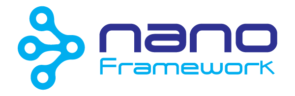

   

-----
文档语言: [English](README.md) | [简体中文](README.zh-cn.md)

# .NET **nanoFramework** 首页

这个 _Home_ 存储库对于想要了解 .NET nanoFramework、为其做出贡献或提出问题的开发人员来说，是个起点。它包含指向 .NET **nanoFramework** 使用的各种 GitHub 存储库的链接。

.NET **nanoFramework** 的目标是成为一个能够为受限嵌入式设备编写托管代码应用程序的平台。开发者可以利用熟悉的 IDE Visual Studio 和 .NET(C#) 知识快速编写应用程序，而无需担心微控制器的低层硬件复杂性。

它是 [.NET Foundation](https://www.dotnetfoundation.org/) 的一部分。

作为一名 _开发人员_，您可能会适合以下的一个(或多个😉)_角色_：

- 您可以享受为微控制器开发 C# 应用程序的乐趣。
- 您可以成为贡献者，因为有很多领域可以表达自己：
  - 使用我们的平台抽象层和硬件抽象层 RTOS 直接在 MCU 上低层工作的 C/C++ 原生驱动程序，为 nanoFramework 开发 .NET CLR。
  - 托管 C# 以编写新的类和驱动程序，以向 .NET nanoFramework 添加更多绑定、库。
  - 托管 C# 以编写 Visual Studio Extensibility、debugger，主要是 .NET Core/.NET 5 CLI 应用程序。
  - 帮助设置 Azure DevOps Pipelines 以尽可能实现自动化。
  - 编写和改进我们的单元测试。
  - 通过回答他人的问题来帮助他人。
  - 编写和改进文档、进行 PR 审查或参与整个项目组织。

.NET nanoFramework 是一种有趣的学习方式。这是一个完整的项目，有很多深入的工程。你会发现一个充满活力的社区来帮助你，你也将能够提供帮助。我们欢迎各种贡献，我们的目标是提高贡献者的知名度。
# 赞助 .NET **nanoFramework**

大多数核心团队成员和贡献者都是嵌入式系统爱好者，对编码充满热情，喜欢挑战。.NET **nanoFramework** 的工作主要在空闲时间完成。一些核心成员碰巧在赞助大量 **nanoFramework** 的公司工作，并为该项目提供工作时间。如果您使用 .NET **nanoFramework** 进行严肃的工作或想要支持它，请捐赠。这允许支付基础设施成本和更多的时间投入到项目上。除了捐款外，还有其他几种方式可以贡献。请在 [这里](http://docs.nanoframework.net/content/contributing/index.html) 阅读有关此内容的文档。

我们如何使用捐赠：

- 支付基础设施成本。
- 宣传推广项目。
- 支持在项目中投入大量时间的维护人员和贡献者。
- 支持 .NET **nanoFramework** 所依赖的项目。
- 制作产品文档、教程以及其它内容，以支持使用 .NET **nanoFramework** 的其他开发人员。
- 组织活动演示 .NET **nanoFramework**

## 赞助商

赞助商将在我们的Github自述文件和主页上获得他们的徽标和链接。

### 铜牌赞助商

 

## 支持者

支持者是那些用钱帮助支持 nanoFramework 的个人。每一点都有帮助，我们感谢所有的贡献，即使是最小的贡献。

## 其他支持者和赞助商

还有其他人和组织一直以多种方式为 .NET **NanoFramework** 做出贡献：赞助对缺失或需要改进的功能进行编码、支付费用、对功能进行编码或……我们要感谢这些赞助商。

<table>
 <tr>
    <td></td>
    <td></td>
 </tr>
</table>

## 参考板固件

以下每个ZIP文件包括了 nanoBooter 和 nanoCLR 图像文件（HEX，BIN，DFU）。可以使用相应烧写工具把它们写入目标板卡中。

**稳定** 版本是 RTM 构建，具有尽可能小的编译。它们包括最新的稳定版本。调试功能处于禁用状态，并且只有极少（或无）错误消息。

**预览** 版是目标板持续编译。它包含所有功能和错误修正的最新版本，也包括调试信息和详细错误信息。

您还可以为社区提供的目标板找到其他几个固件映像。在 [社区目标库](https://github.com/nanoframework/nf-Community-Targets) 上检查可用的链接并下载。

### ESP32 modules and boards

| 目标 | 说明 | 稳定版 | 预览版 |
|:-|---|---|---|
| ESP32_PSRAM_REV0 | |  |  |
| ESP32_REV0 | |  |  |
| ESP32_PSRAM_XTAL26_REV0 | |  |  |
| ESP32_PSRAM_REV3 | |  |  |
| ESP32_REV3 | |  |  |
| ESP32_BLE_REV0 | |  |  |
| ESP32_BLE_REV3 | |  |  |
| ESP_WROVER_KIT | |  |  |
| ESP32_PICO | |  |  |
| ESP32_LILYGO | |  |  |
| ESP32_S2_USB | |  |  |
| ESP32_S2_UART | |  |  |
| ESP32_C3 | |  |  |
| ESP32_C3_REV3 | |  |  |
| XIAO_ESP32C3 | |  |  |
| ESP32_C6_Thread | |  |  |
| ESP32_H2_Thread | |  |  |
| ESP32_ETHERNET_KIT_1.2 | |  |  |
| ESP32_WT32_ETH01 | |  |  |
| ESP32_WESP32 | |  |  |
| ESP32_OLIMEX | |  |  |
| ESP32_OLIMEX_WROVER | |  |  |
| ESP32_GenericDisplay_REV0 | |  |  |
| ESP32_PSRAM_BLE_GenericGraphic_REV3 | |  |  |
| ESP32_PSRAM_REV3_IPV6 | |  |  |
| ESP32_S3 | |  |  |
| ESP32_S3_BLE | |  |  |
| ESP32_S3_ALL | |  |  |
| ESP32_S3_BLE_UART | |  |  |
| ESP32_S3_ALL_UART | |  |  |
| ESP32_P4_UART | |  |  |
| ESP32_P4_USB | |  |  |

### M5Stack

| 目标 | 稳定版 | 预览版 |
|:-|---|---|
| [M5Core](https://docs.m5stack.com/en/core/gray) |  |  |
| [M5StickC](https://docs.m5stack.com/en/core/m5stickc) |  |  |
| [M5StickCPlus](https://docs.m5stack.com/en/core/m5stickc_plus) |  |  |
| [M5Core2](https://docs.m5stack.com/en/core/core2) |  |  |
| [AtomS3](https://docs.m5stack.com/en/core/AtomS3) |  |  |

### STM32 boards and chip based

| 目标 | 稳定版 | 预览版 |
|:-|---|---|
| MXCHIP_AZ3166 |  |  |
| ST_STM32F429I_DISCOVERY (B01) |  |  |
| ST_NUCLEO64_F091RC |  |  |
| ST_STM32F769I_DISCOVERY |  |  |
| ORGPAL_PALTHREE |  |  |
| ORGPAL_PALX |  |  |

### Silicon Labs Giant Gecko boards

| 目标 | 稳定版 | 预览版 |
|:-|---|---|
| SL_STK3701A |  |  |
| SL_STK3701A_REVB |  |  |

### NXP boards

| 目标 | 稳定版 | 预览版 |
|:-|---|---|
| NXP_MIMXRT1060_EVK |  |  |

### TI boards

| 目标 | 稳定版 | 预览版 |
|:-|---|---|
| TI_CC1352R1_LAUNCHXL_868 |  |  |
| TI_CC1352R1_LAUNCHXL_915 |  |  |
| TI_CC3220SF_LAUNCHXL |  |  |

以上固件支持以下类库和功能：

  
点击展开

  | Target                  | Gpio               | Spi                | I2c                | Pwm                | Adc                | Dac                | Serial             | OneWire            | Events             | SWO                | Networking         | Bluetooth BLE    | Large Heap         | UI         |
  |:-:                      |:-:                 |:-:                 |:-:                 |:-:                 |:-:                 |:-:                 |:-:                 |:-:                 |:-:                 |:-:                 |:-:                 |:-:                 |:-:                 |:-:                 |
  | ESP32_PSRAM_REV0          | :heavy_check_mark: | :heavy_check_mark: | :heavy_check_mark: | :heavy_check_mark: | :heavy_check_mark: | :heavy_check_mark: | :heavy_check_mark: | :heavy_check_mark: | :heavy_check_mark: |                    | :heavy_check_mark: |                    | :heavy_check_mark: |                    |
  | ESP32_REV0          | :heavy_check_mark: | :heavy_check_mark: | :heavy_check_mark: | :heavy_check_mark: | :heavy_check_mark: | :heavy_check_mark: | :heavy_check_mark: | :heavy_check_mark: | :heavy_check_mark: |                    | :heavy_check_mark: |                    | :heavy_check_mark: |                    |
  | ESP32_PSRAM_XTAL26_REV0          | :heavy_check_mark: | :heavy_check_mark: | :heavy_check_mark: | :heavy_check_mark: | :heavy_check_mark: | :heavy_check_mark: | :heavy_check_mark: | :heavy_check_mark: | :heavy_check_mark: |                    | :heavy_check_mark: |                    | :heavy_check_mark: |                    |
  | ESP32_PSRAM_REV3          | :heavy_check_mark: | :heavy_check_mark: | :heavy_check_mark: | :heavy_check_mark: | :heavy_check_mark: | :heavy_check_mark: | :heavy_check_mark: | :heavy_check_mark: | :heavy_check_mark: |                    | :heavy_check_mark: |                    | :heavy_check_mark: |                    |
  | ESP32_REV3          | :heavy_check_mark: | :heavy_check_mark: | :heavy_check_mark: | :heavy_check_mark: | :heavy_check_mark: | :heavy_check_mark: | :heavy_check_mark: | :heavy_check_mark: | :heavy_check_mark: |                    | :heavy_check_mark: |                    | :heavy_check_mark: |                    |
  | ESP32_BLE_REV0      | :heavy_check_mark: | :heavy_check_mark: | :heavy_check_mark: | :heavy_check_mark: | :heavy_check_mark: | :heavy_check_mark: | :heavy_check_mark: | :heavy_check_mark: | :heavy_check_mark: |                    | :heavy_check_mark: | :heavy_check_mark: |                    |                    |
  | ESP32_BLE_REV3      | :heavy_check_mark: | :heavy_check_mark: | :heavy_check_mark: | :heavy_check_mark: | :heavy_check_mark: | :heavy_check_mark: | :heavy_check_mark: | :heavy_check_mark: | :heavy_check_mark: |                    | :heavy_check_mark: | :heavy_check_mark: |                    |                    |
  | ESP_WROVER_KIT          | :heavy_check_mark: | :heavy_check_mark: | :heavy_check_mark: | :heavy_check_mark: | :heavy_check_mark: | :heavy_check_mark: | :heavy_check_mark: | :heavy_check_mark: | :heavy_check_mark: |                    | :heavy_check_mark: |                    | :heavy_check_mark: | :heavy_check_mark: |
  | ESP32_PICO          | :heavy_check_mark: | :heavy_check_mark: | :heavy_check_mark: | :heavy_check_mark: | :heavy_check_mark: | :heavy_check_mark: | :heavy_check_mark: | :heavy_check_mark: | :heavy_check_mark: |                    | :heavy_check_mark: |   |                    |                    |
  | ESP32_LILYGO          | :heavy_check_mark: | :heavy_check_mark: | :heavy_check_mark: | :heavy_check_mark: | :heavy_check_mark: | :heavy_check_mark: | :heavy_check_mark: | :heavy_check_mark: | :heavy_check_mark: |                    | :heavy_check_mark: Wi-Fi + Ethernet |  |             |                    |
  | ESP32_S2_USB      | :heavy_check_mark: | :heavy_check_mark: | :heavy_check_mark: | :heavy_check_mark: | :heavy_check_mark: | :heavy_check_mark: | :heavy_check_mark: | :heavy_check_mark: | :heavy_check_mark: |                    | :heavy_check_mark: |  |                    |                    |
  | ESP32_S2_UART     | :heavy_check_mark: | :heavy_check_mark: | :heavy_check_mark: | :heavy_check_mark: | :heavy_check_mark: | :heavy_check_mark: | :heavy_check_mark: | :heavy_check_mark: | :heavy_check_mark: |                    | :heavy_check_mark: |  |                    | :heavy_check_mark: |
  | ESP32_C3          | :heavy_check_mark: | :heavy_check_mark: | :heavy_check_mark: | :heavy_check_mark: | :heavy_check_mark: | | :heavy_check_mark: | :heavy_check_mark: | :heavy_check_mark: |                    | :heavy_check_mark: |                    | | |
  | XIAO_ESP32C3     | :heavy_check_mark: | :heavy_check_mark: | :heavy_check_mark: | :heavy_check_mark: | :heavy_check_mark: | | :heavy_check_mark: | :heavy_check_mark: | :heavy_check_mark: |                    | :heavy_check_mark: |                    | | |
  | ESP32_OLIMEX          | :heavy_check_mark: | :heavy_check_mark: | :heavy_check_mark: | :heavy_check_mark: | :heavy_check_mark: | :heavy_check_mark: | :heavy_check_mark: | :heavy_check_mark: |                    | :heavy_check_mark: | :heavy_check_mark: Wi-Fi + Ethernet  |  | :heavy_check_mark: |                    |
  | M5Core          | :heavy_check_mark: | :heavy_check_mark: | :heavy_check_mark: | :heavy_check_mark: | :heavy_check_mark: | :heavy_check_mark: | :heavy_check_mark: | :heavy_check_mark: |                    | :heavy_check_mark: | :heavy_check_mark: Wi-Fi  |  | :heavy_check_mark: |                    |
  | M5StickC          | :heavy_check_mark: | :heavy_check_mark: | :heavy_check_mark: | :heavy_check_mark: | :heavy_check_mark: | :heavy_check_mark: | :heavy_check_mark: | :heavy_check_mark: |                    | :heavy_check_mark: | :heavy_check_mark: Wi-Fi |  | :heavy_check_mark: |                    |
  | M5StickCPlus          | :heavy_check_mark: | :heavy_check_mark: | :heavy_check_mark: | :heavy_check_mark: | :heavy_check_mark: | :heavy_check_mark: | :heavy_check_mark: | :heavy_check_mark: |                    | :heavy_check_mark: |  :heavy_check_mark: Wi-Fi  |  | :heavy_check_mark: |                    |
  | M5Core2          | :heavy_check_mark: | :heavy_check_mark: | :heavy_check_mark: | :heavy_check_mark: | :heavy_check_mark: | :heavy_check_mark: | :heavy_check_mark: | :heavy_check_mark: |                    | :heavy_check_mark: | :heavy_check_mark: Wi-Fi |  | :heavy_check_mark: |                    |
  | ESP32_GenericDisplay_REV0 | :heavy_check_mark: | :heavy_check_mark: | :heavy_check_mark: | :heavy_check_mark: | :heavy_check_mark: | :heavy_check_mark: | :heavy_check_mark: | :heavy_check_mark: |                    | :heavy_check_mark: | :heavy_check_mark: Wi-Fi  |  | :heavy_check_mark: |                    |
  | ESP32_PSRAM_BLE_GenericGraphic_REV3          | :heavy_check_mark: | :heavy_check_mark: | :heavy_check_mark: | :heavy_check_mark: | :heavy_check_mark: | :heavy_check_mark: | :heavy_check_mark: | :heavy_check_mark: |                    | :heavy_check_mark: | :heavy_check_mark: Wi-Fi |  | :heavy_check_mark: |                    |
  | MXCHIP_AZ3166 | :heavy_check_mark: | :heavy_check_mark: | :heavy_check_mark: | :heavy_check_mark: |  |  | :heavy_check_mark: |  |  |  |  |  |  |  |
  | ST_STM32F429I_DISCOVERY (B01) | :heavy_check_mark: | :heavy_check_mark: | :heavy_check_mark: | :heavy_check_mark: | :heavy_check_mark: |                    | :heavy_check_mark: | :heavy_check_mark: | :heavy_check_mark: | :heavy_check_mark: |                    |                    | :heavy_check_mark: |                    |
  | ST_NUCLEO64_F091RC      | :heavy_check_mark: | :heavy_check_mark: | :heavy_check_mark: | :heavy_check_mark: |                    |                    | :heavy_check_mark: | :heavy_check_mark: | :heavy_check_mark: | :heavy_check_mark: |                    |                    |                    |                    |
  | ST_STM32F769I_DISCOVERY | :heavy_check_mark: | :heavy_check_mark: | :heavy_check_mark: | :heavy_check_mark: | :heavy_check_mark: | :heavy_check_mark: | :heavy_check_mark: | :heavy_check_mark: | :heavy_check_mark: | :heavy_check_mark: | :heavy_check_mark: |                    | :heavy_check_mark: | :heavy_check_mark: |
  | ORGPAL_PALTHREE | :heavy_check_mark: | :heavy_check_mark: | :heavy_check_mark: | :heavy_check_mark: | :heavy_check_mark: | :heavy_check_mark: | :heavy_check_mark: | :heavy_check_mark: | :heavy_check_mark: | :heavy_check_mark: | :heavy_check_mark: |                    | :heavy_check_mark: |                    |
  | ORGPAL_PALX | :heavy_check_mark: | :heavy_check_mark: | :heavy_check_mark: | :heavy_check_mark: | :heavy_check_mark: | :heavy_check_mark: | :heavy_check_mark: | :heavy_check_mark: | :heavy_check_mark: | :heavy_check_mark: | :heavy_check_mark: |                    | :heavy_check_mark: |                    |
  | SL_STK3701A_REVB | :heavy_check_mark: | :heavy_check_mark: | :heavy_check_mark: | :heavy_check_mark: | :heavy_check_mark: |  | :heavy_check_mark: |  | :heavy_check_mark: | :heavy_check_mark: |  |                    |  |  |
  | SL_STK3701A | :heavy_check_mark: | :heavy_check_mark: | :heavy_check_mark: | :heavy_check_mark: | :heavy_check_mark: |  | :heavy_check_mark: |  | :heavy_check_mark: | :heavy_check_mark: |  |                    |  |  |
  | TI_CC1352R1_LAUNCHXL    | :heavy_check_mark: |  |  |  |  |                    |                    |                    |  |                    |  |                    |                    |                    |
  | TI_CC3220SF_LAUNCHXL    | :heavy_check_mark: | :heavy_check_mark: | :heavy_check_mark: | :heavy_check_mark: | :heavy_check_mark: |                    |                    |                    | :heavy_check_mark: |                    | :heavy_check_mark: |                    |                    |                    |
  | NXP_MIMXRT1060_EVK           | :heavy_check_mark: |  |  |  |  |  | :heavy_check_mark:  |                    | :heavy_check_mark: |                    | :heavy_check_mark: |                    | :heavy_check_mark: |                    |

## 存储库

我们的GitHub团队拥有用于固件、类库、文档和工具的各种存储库。你可以在 [这里](docs/organization/README.md) 得到一个列表和描述。

## 如何参与、贡献和提供反馈

贡献的一些最佳方法是尝试一下，记录错误并加入设计对话。

如果你有一个问题，需要澄清某件事，需要对特定情况的帮助或想要开始讨论，请不要在这里 (Github Issues) 提出问题。我们要求您仅在有真实且已确认的问题时才在 Github Issues 提出问题。最好先在我们的 [Discord](https://discord.gg/gCyBu8T) 频道中讨论。请选择最适合您所面临的问题的频道，以便主题专家最有可能及时回答。或者你可以去 [Stack Overflow](https://stackoverflow.com/questions/tagged/nanoframework) 并在那里提问题，确保使用 `nanoframework` 标签。

如果您无法使用 Discord，则应在 [Discussion](https://github.com/nanoframework/Home/discussions) 中开始讨论。

在寻找需要解决的若干问题？请查看主存储库上的待抓问题列表，[up-for-grabs issues](https://github.com/nanoframework/Home/issues?q=is%3Aissue+is%3Aopen+label%3Aup-for-grabs) ，这是一个很好的切入点。

有关更多详细信息，请参阅我们的一些指南：

- [贡献指南](https://github.com/nanoframework/.github/blob/master/CONTRIBUTING.md)
- [贡献流程](https://docs.nanoframework.net/content/contributing/contributing-workflow.html)

## 许可证

.NET **nanoFramework** 库、固件映像、工具和示例根据 [MIT license](LICENSE.md) 获得许可。

## 文档

### [文档](https://docs.nanoframework.net)

无论您是新手还是老手，项目文档都是查找有关 .NET **nanoFramework** 信息的好地方。它按以下类别组织：

- [API手册](http://docs.nanoframework.net/api) 各种类库的文档。
- [开发C#应用](https://docs.nanoframework.net/content/getting-started-guides/getting-started-managed.html#coding-a-hello-world-application) 使用 .NET **nanoFramework**.
- [编译映像](https://docs.nanoframework.net/content/building/index.html) 加载到目标板上。
- [.NET **nanoFramework** 架构](https://docs.nanoframework.net/content/architecture/index.html) 不同的部分是如何组合在一起的。
- [贡献 .NET **nanoFramework**](https://docs.nanoframework.net/content/contributing/index.html) 包括如何为项目做出贡献的概述。

### [博客](https://www.nanoframework.net/blog)

我们通过博客尝试发布关于开发状态的详细更新，关于某个特定功能的技术文章，或者设计选项。

### [YouTube 频道](https://www.youtube.com/c/nanoFramework)

我们还有一个YouTube 频道，里面有视频教程，还有关于我们正在试验的功能演示和新想法构思。

## 行为准则

该项目通过了《贡献者公约》界定的行为守则，以澄清我们社区的预期行为。
有关详细信息，请参阅 [.NET Foundation 行为准则](https://dotnetfoundation.org/行为准则)。
