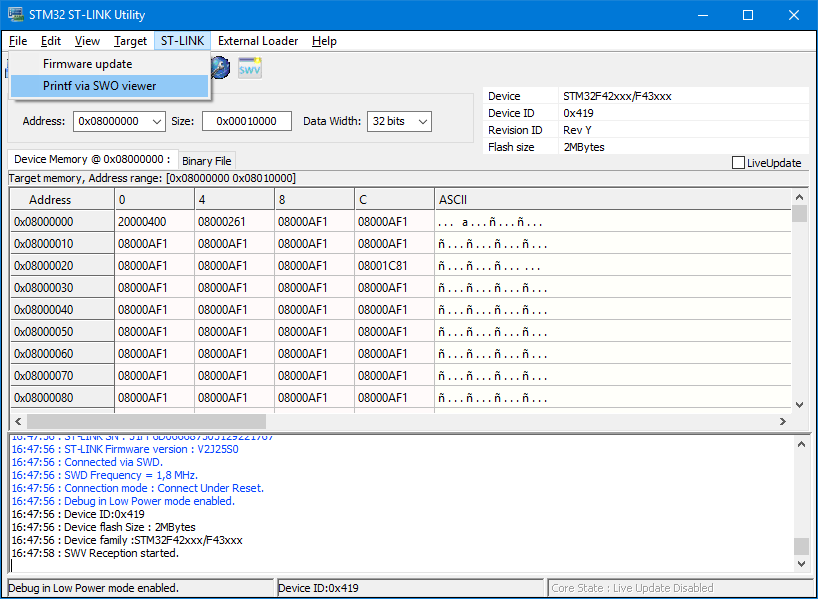
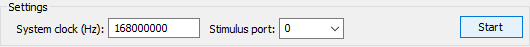
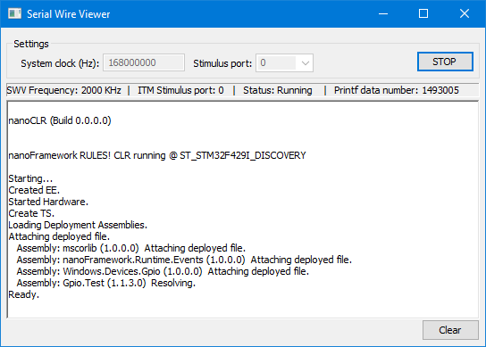

# Using ARM Cortex-M Single Wire Output (SWO)

**About this document**

This document describes how to use Cortex-M SWO to output data from **nanoFramework**.

## Prerequisites

You'll need:
- Target board with SWO pin free _and_ configured in it's reset state (meaning not used by GPIO or any other peripheral and not configured in any alternate mode).
- If using a stock board it's also convenient to check the schematics if any hardware changes are required (e.g. STM F429I_DISCOVERY board requires solder bridge SB9 to be soldered).
- Software capable of driving and outputting data from an SWO source. (ST-Link)[http://www.st.com/content/st_com/en/products/embedded-software/development-tool-software/stsw-link004.html] is an excellent tool for this purpose.
- Set **nanoFramework** build options to include support for SWO (either setting `"SWO_OUTPUT" : "ON"` in cmake-variants.json or launching CMake with -DSWO_OUPUT=ON).

## Outputting SWO

1. Load the target flash with a **nanoFramework** image build with SWO option

2. On ST-Link menu choose ST-Link -> Printf via SWO viewer

3. After SWO viewer windows loads, set the Sytem clock to match the target and the Stimulus port to `0`.

4. Click the Start button and watch the output in the main window area.

