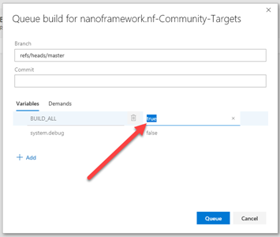

# Community targets build and publishing

**About this document**

This document describes the recipe to setup the build and publish of new Community targets.

## Introduction

The build of each of the Community targets is a job in Azure Pipelines yaml.

The build of each target is triggered by adding to the commit message (or PR description) a _token_ (or more than one) or `#ALL#`. The _token_ is the board name enclosed in '#', e.g. `#ST_STM32F4_DISCOVERY#`. Note that it's possible to add more than one token to the commit message to trigger the build for the specific targets.

## Setup the build for a new target

Update the [azure-pipelines.yml](https://github.com/nanoframework/nf-Community-Targets/blob/master/azure-pipelines.yml) in the Community repository as follows:

1. Start by adding a new job to the collection. Preferably copy/paste from a similar target.

2. Make sure to use the target name at the various places where it shows, namely: job name, condition expression and variables.

## Setup the image publishing

Community target images are distributed through **nanoFramework** JFrog Bintray [repository](https://bintray.com/nfbot/nanoframework-images-community-targets).

1. Sign-in with **nanoFramework** Bintray account.
2. Go to nanoframework-images-community-targets repository [here](https://bintray.com/nfbot/nanoframework-images-community-targets)

3. Add a new package inside that repository. 
   - The package name must be **exactly** the same as the target name otherwise the publish step will fail.
   - The remaining details are to be copied from one of the other existing targets. Mind the description field to update the target name and possibly the manufacturer.

4. Go to the package main page of the recently created package and grab the markdown from the "Latest Version Badge" link there and past it in the Community targets list in the readme.

## PRs and manual builds

When merging a PR make sure to add to the commit message the token(s) for the targets to build, otherwise the merge to the master branch won't trigger a build for any board.

It's possible to manually start a build _and_ specify that it should build all targets. This is most handy, for example, after a number of changes in the nf-interpreter repo to build new images for the Community targets. Another situation is when one forgets to add the build token in the PR merge and needs to trigger a build afterwards.

To do this, go to the Builds page in the project Azure Pipelines and hit the 'Queue' button. When the pop-up shows, change the BUILD_ALL variable to 'true'. Like this:

